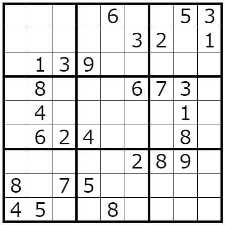

# チュートリアル(2): Array の使い方

cspuz には，CSP 変数の 1 次元ないし 2 次元の配列を表すための `Array` 型が定義されています．
これを用いると，パズル盤面全体に対する制約を簡潔に書けることがあります．
また，次の章でグラフコンポーネントを紹介しますが，これは Array を用いるとより効果的に用いることができます．

## Array の宣言

真偽値変数の Array は `solver.bool_array(shape)` で作成することができます．
`shape` は Array の形状を表す `int` もしくはタプルです．

```
>>> solver = cspuz.Solver()
>>> a = solver.bool_array(5)
>>> b = solver.bool_array((3, 4))
```

`a` は長さ 5 の 1 次元配列，`b` は 3*4 の 2 次元配列になります．

整数値変数の Array は `solver.int_array(shape, low, high)` で作成することができます．
`shape` は Array の形状を表す `int` もしくはタプル，`low`, `high` はそれぞれ各変数の最小値，最大値です．

```
>>> solver = cspuz.Solver()
>>> a = solver.int_array(5, 0, 2)
>>> b = solver.int_array((3, 4), -2, 1)
```

`a` は `0` 以上 `2` 以下の値をとる変数 5 つの 1 次元配列，`b` は `-2` 以上 `1` 以下の値をとる変数の 3*4 の 2 次元配列になります．

Array の要素へのアクセスは，通常の list などと同様に `[]` で可能です．なお，2 次元 Array に対しては `x[1][2]` のようにしなくても `x[1, 2]` のようにもアクセス可能です：
```
>>> solver = cspuz.Solver()
>>> a = solver.int_array(5, 0, 2)
>>> b = solver.int_array((3, 4), -2, 1)
>>> solver.ensure(a[1] == b[0, 2])
```

## numpy をご存知の方へ

cspuz の Array の演算子に対する挙動は `numpy.array` とほとんど同じです．次の「Array の演算」「スライス」の節は読み飛ばしていただいてかまいません．
ただし，以下の差異に注意してください：

- Array 同士での broadcast はエラーとなる．例えば，`solver.bool_array((5, 5)) & solver.bool_array((1, 5))` などはできない
- Array の要素への代入はできない．
- Array に対する `iter` は，Array の次元によらず，各要素を順に返す．

## Array の演算

前章で述べた演算子は，同じ形の Array 同士に対しても適用することができます．
この場合，各要素に対してその演算子を適用した値を要素に持つ，同じ形の Array が返されます．

```
>>> solver = cspuz.Solver()
>>> a = solver.bool_array(5)
>>> b = ~a  # [~a[0], ~a[1], ~a[2], ~a[3], ~a[4]]
```

さらに，単一の値と Array に対しても演算子を適用することができます．
この場合，その単一の値と Array の各要素に対してその演算子を適用した値を要素に持つ，同じ形の Array が返されます．

```
>>> solver = cspuz.Solver()
>>> a = solver.int_var(1, 3)
>>> b = solver.int_array((2, 2), 3, 5)
>>> solver.ensure(a == b)  # a == b[0, 0] and a == b[0, 1] and a == b[1, 0] and a == b[1, 1]
```

ちなみに，この例のように，Array を `solver.ensure` に直接与えることも可能です．この場合，Array の要素すべてが充足される (true になる) ことを制約として要請します．
他にも，前章で出てきた `fold_true`, `alldifferent` などもすべて Array を直接引数にとれるようになっています．

## スライス

`[]` で Array にアクセスする際に，単一の位置を `int` で与える代わりに，スライスを与えることができます．

```
>>> solver = cspuz.Solver()
>>> a = solver.int_array((3, 4), 0, 5)
```

原則として `x:y` は `x` 以上 `y` 未満のインデクスを指します．`x` を省略すると `0`，`y` を省略すると対応する軸のサイズとなります：
```
>>> a[1:3, 0:2]  # [[a[1, 0], a[1, 1]], [a[2, 0], a[2, 1]]]
>>> a[1:, :2]  # [[a[1, 0], a[1, 1]], [a[2, 0], a[2, 1]]]
```

ただし，負の値を与えた場合は，その値を対応する軸のサイズに加えた値となります：
```
>>> a[:-1, 0:1]  # [[a[0, 0], a[1, 0], a[2, 0]]]
```

スライスの代わりに単一の位置を与えると，その軸をその位置で固定し，より次元の低い Array が返されます：
```
>>> a[2, :]  # [a[2, 0], a[2, 1], a[2, 2], a[2, 3]]
>>> a[2:3, :]  # [[a[2, 0], a[2, 1], a[2, 2], a[2, 3]]]
>>> a[2, :] == a[2:3, :]  # Array の次元の不一致でエラー
```

## 実際にパズル問題を解かせてみる

この章で紹介した Array を用いて，実際にパズルを自動解答させてみましょう．
ここでは数独の自動解答を例に示します．

例題として，次の問題を解かせることを考えます：

http://pzv.jp/p.html?sudoku/9/9/j6h53k32g1g139l8i673h4k1h624i8l289g8g75k45h8j



（ちなみに，この問題はこのチュートリアルのために自動生成させたものです．現在の puzrs では，数独の自動生成も極めて簡潔に書くことができます．詳細は後の章で説明します）

ここからは記述量が長くなるので，Python のインタラクティブ環境ではなく，ソースファイルに順次書いていくことを前提にコード例を示していきます．

まず，Solver を用意します．

```
import cspuz

solver = cspuz.Solver()
```

数独では 9×9 のマス目の各マスに 1 以上 9 以下の整数を入れるため，9×9 の整数変数配列を用意します．
また，これらの変数は解答盤面において「確定しているべき値」であるため，`add_answer_key` を用いて solver に登録します．

```
answer = solver.int_array((9, 9), 1, 9)
solver.add_answer_key(answer)
```

問題盤面における表出数字の制約を与えます．

```
problem = [
    [0, 0, 0, 0, 6, 0, 0, 5, 3],
    [0, 0, 0, 0, 0, 3, 2, 0, 1],
    [0, 1, 3, 9, 0, 0, 0, 0, 0],
    [0, 8, 0, 0, 0, 6, 7, 3, 0],
    [0, 4, 0, 0, 0, 0, 0, 1, 0],
    [0, 6, 2, 4, 0, 0, 0, 8, 0],
    [0, 0, 0, 0, 0, 2, 8, 9, 0],
    [8, 0, 7, 5, 0, 0, 0, 0, 0],
    [4, 5, 0, 0, 8, 0, 0, 0, 0],
]
for y in range(9):
    for x in range(9):
        if problem[y][x] != 0:
            solver.ensure(answer[y, x] == problem[y][x])
```

各行，列において，すべての数字が異なるという制約を与えます．

```
for y in range(9):
    solver.ensure(cspuz.alldifferent(answer[y, :]))
for x in range(9):
    solver.ensure(cspuz.alldifferent(answer[:, x]))
```

ここで Array のスライス記法を用いています．`answer` は 9×9 の Array なので，`answer[y, :]` は `answer[y, 0:9]` と等価です．

最後に，各ブロックにおいて，すべての数字が異なるという制約を与えます．

```
for gy in range(3):
    for gx in range(3):
        solver.ensure(cspuz.alldifferent(answer[gy*3:(gy+1)*3, gx*3:(gx+1)*3]))
```

これでルールはすべて記述できているでしょうか？
[数独のルール](https://www.nikoli.co.jp/ja/iphone/sd_tutorial/) を見ると，各行（列，ブロック）に対して，1 から 9 の数字のそれぞれが現れるという制約を加えないといけないようにも見えます．しかし，これは「盤面のサイズが 9×9」「各行，列，ブロックの中の数字はすべて異なる」という今まで書いた制約から従うため，改めて書かなくても問題はありません．（ただし，一般には，あえて冗長な制約を記述したほうが速く解が得られるということもしばしばあります）


ここまで来たら，solver に問題を解かせることができます．
```
solver.solve()
```

得られた解は，変数に対して `var.sol` を見ることで確認できるのでした．
```
for y in range(9):
    for x in range(9):
        print(answer[y, x].sol, end=' ')
    print()
```

ここで示したコードを実行すると，次のように解が得られることが確かめられます：

```
2 7 8 1 6 4 9 5 3
5 9 4 8 7 3 2 6 1
6 1 3 9 2 5 4 7 8
9 8 1 2 5 6 7 3 4
7 4 5 3 9 8 6 1 2
3 6 2 4 1 7 5 8 9
1 3 6 7 4 2 8 9 5
8 2 7 5 3 9 1 4 6
4 5 9 6 8 1 3 2 7
```
